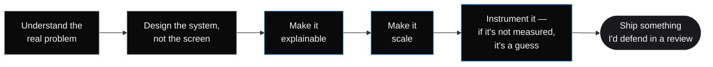
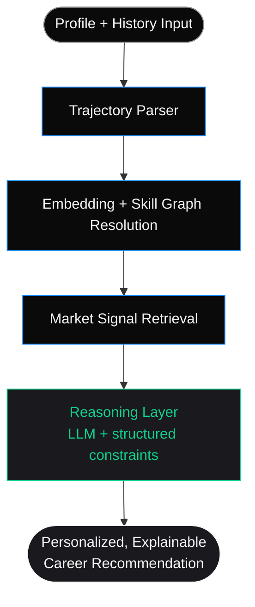
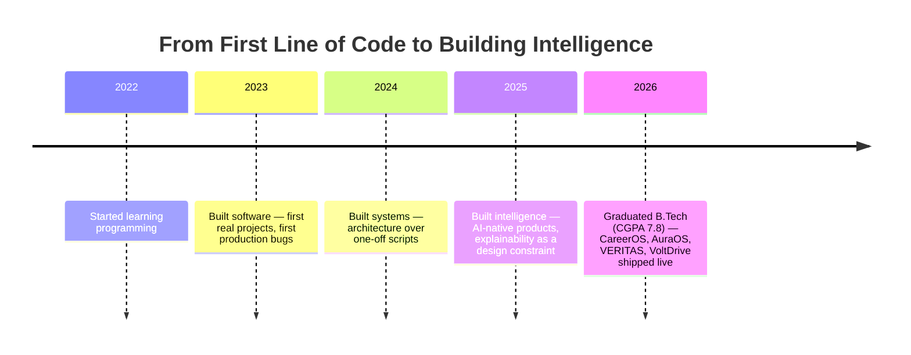

<div align="center">

<!-- ============================================================
     GOPALA JOSYULA SIVA SATYA SAI BHAGAVAN — "TheNameIsBhagavan"
     GitHub Profile README — v2 / High-End Edition
     ============================================================ -->


<br/>

<a href="https://www.thenameisbhagavan.in">
  
</a>

<br/><br/>

<p>
  
  
  
  
</p>

<p>
  <a href="https://www.thenameisbhagavan.in"></a>
  <a href="#"></a>
  <a href="#"></a>
  <a href="#"></a>
  <a href="mailto:you@example.com"></a>
</p>


<br/>


<br/><br/>

<a href="#-manifesto"><b>Manifesto</b></a> ·
<a href="#-how-i-think"><b>How I Think</b></a> ·
<a href="#-technology-stack"><b>Stack</b></a> ·
<a href="#-featured-products"><b>Products</b></a> ·
<a href="#-system-design-deep-dive"><b>Deep Dive</b></a> ·
<a href="#-open-source--community"><b>Open Source</b></a> ·
<a href="#-writing--ideas"><b>Writing</b></a> ·
<a href="#-engineering-timeline"><b>Timeline</b></a> ·
<a href="#-github-statistics"><b>Stats</b></a> ·
<a href="#-contact"><b>Contact</b></a>

</div>


<br/>

## Manifesto

> **Most people write code. Fewer people engineer systems.**
> The difference shows up under load — when the model is wrong, when traffic spikes, when the edge case turns out to be the whole point. I care less about whether something *runs* and more about whether it *holds* — under scale, under scrutiny, under someone else's use case, at 3am when I'm not the one on call to explain it.

I'm **Gopala Josyula Siva Satya Sai Bhagavan** — building under the name **TheNameIsBhagavan**. I design and ship intelligent systems where AI reasoning, backend architecture, and human-centered frontend design are treated as **one discipline**, not three handoffs stapled together in a sprint review.

I completed my **B.Tech in April 2026 with a CGPA of 7.8** — but the degree closed one chapter of *how* I learned to build. The four products below are the chapter that actually mattered: each one shipped, each one live, each one built to a standard I'd defend in front of a staff engineering panel.

<table>
<tr>
<td width="50%" valign="top">

### What I optimize for

- 🧠 Systems that can explain their own decisions
- ⚙️ Architecture that scales before it's asked to
- 🎨 Interfaces that feel inevitable, not decorated
- 🔬 Problems worth solving, not problems worth demoing
- 📐 Decisions I can defend line-by-line in review

</td>
<td width="50%" valign="top">

### What I actively avoid

- ❌ Shipping a model without a documented failure mode
- ❌ UI that exists to look busy instead of clear
- ❌ Architecture I inherited instinct for but can't explain
- ❌ Features nobody asked to have solved
- ❌ "It works on my machine" as a definition of done

</td>
</tr>
</table>

<br/>

## How I Think



I don't build software — I engineer intelligent systems. AI reasoning, backend architecture, frontend experience, and product thinking get treated as one discipline. Every project I ship has to survive three questions honestly: **does it solve something real, does it feel intentional, and could it survive production traffic on a bad day?**

<details>
<summary><b>🔍 Expand — the four questions I ask before writing a line of code</b></summary>
<br/>

| # | Question | Why it matters |
|:-:|:--|:--|
| 1 | **What breaks first under load, and how will I know?** | Forces observability into the design phase, not the postmortem. |
| 2 | **Can I explain this decision to someone who didn't make it?** | If the reasoning only lives in my head, it isn't actually engineered — it's improvised. |
| 3 | **What's the cost of being wrong here?** | Calibrates how much rigor a component actually deserves — not everything needs the same bar. |
| 4 | **Would I be comfortable if this ran unattended for a year?** | The real test of whether something is "done" or just "working today." |

</details>

<br/>

## Current Focus

<div align="center">

| | |
|:--|:--|
| 🔭 **Currently building** | Explainable AI systems and full-stack intelligence platforms across CareerOS, AuraOS, and VERITAS |
| 🌱 **Currently learning** | Agentic system design, distributed inference, advanced retrieval architectures |
| 🤝 **Open to** | AI systems engineering roles, product engineering roles, high-signal collaborations |
| 💬 **Ask me about** | AI system design, explainability, product engineering, retrieval systems, career strategy |
| ⚡ **Fun fact** | I'd rather delete 200 lines than add 20 to fix a symptom |
| 📫 **Reach me** | [thenameisbhagavan.in](https://www.thenameisbhagavan.in) |

</div>

<br/>

## Skills at a Glance

<div align="center">


</div>

<br/>


<br/>

## Technology Stack

<div align="center">

<table>
<tr><td align="center" width="18%"><b>AI / GenAI</b></td><td width="82%">


</td></tr>
<tr><td align="center"><b>Frontend</b></td><td>


</td></tr>
<tr><td align="center"><b>Backend</b></td><td>


</td></tr>
<tr><td align="center"><b>Cloud &amp; DevOps</b></td><td>


</td></tr>
<tr><td align="center"><b>Tooling</b></td><td>


</td></tr>
</table>

</div>

<br/>


<br/>

## Featured Products

<sub>PLACEHOLDER — confirm all links below are live before publishing.</sub>

<table>
<tr>
<td width="50%" valign="top">

### 🧭 CareerOS
**The Intelligence Layer For Every Career.**

An AI-powered career intelligence platform — reasoning over a person's full trajectory rather than pattern-matching keywords to job titles. Built to feel like a strategist, not a search bar.

`Next.js` `FastAPI` `Vector Retrieval` `LLM Reasoning`

<a href="https://careeros-thenameisbhagavan.vercel.app/"></a>

</td>
<td width="50%" valign="top">

### 🌌 AuraOS
**Personal Intelligence Operating System.**

Persistent memory, reasoning, and knowledge layered into a conversational interface built for continuity — designed so context compounds instead of resetting every session.

`React` `Node.js` `Embeddings` `Memory Architecture`

<a href="https://aura-os-thenameisbhagavan.vercel.app/"></a>

</td>
</tr>
<tr>
<td width="50%" valign="top">

### 🔎 VERITAS
**Explainable Intelligence Platform.**

Evidence-first claim verification — every credibility score ships with the full reasoning trace that produced it, never just a verdict. Built around calibration, not raw accuracy.

`Python` `Hybrid Retrieval` `Calibrated Scoring` `Knowledge Graph`

<a href="https://veritas-thenameisbhagavan.vercel.app/"></a>

</td>
<td width="50%" valign="top">

### ⚡ VoltDrive
**Luxury Automotive Experience.**

Premium motion design paired with modern frontend engineering — proof that product craft isn't limited to AI-shaped problems. Cinematic scroll-driven storytelling at 60fps.

`Next.js` `Framer Motion` `WebGL` `Design Systems`

<a href="https://voltdrive-thenameisbhagavan.vercel.app/"></a>

</td>
</tr>
</table>

<br/>

## System Design Deep Dive

Picking one product to show the actual thinking, not just the output — because a live link proves it runs, not that it was engineered.

<details open>
<summary><b>🧭 CareerOS — architecture, decisions, and why</b></summary>
<br/>

**Problem.** Career guidance tools either ask shallow questions and return generic advice, or require so much manual input that nobody finishes onboarding. Neither produces a recommendation worth trusting with an actual decision.

**Solution.** CareerOS builds a structured trajectory model from a person's history, resolves it against a live labor-market signal layer, and reasons over both — rather than treating "give me career advice" as a single LLM prompt with no retrieval underneath it.



**Engineering decision.** The reasoning layer is constrained to only cite from the retrieved market-signal set — it cannot free-generate a recommendation with no grounding. This was a deliberate latency-for-trust tradeoff: retrieval-then-reason is slower than a single prompt, but a recommendation with no traceable source isn't a recommendation, it's a guess with good formatting.

**What I'd do differently at 10x scale.** Move market-signal retrieval to a precomputed, incrementally-updated index rather than querying live at request time — the current design optimizes for freshness over latency, which is the right tradeoff at current scale but wouldn't survive a large concurrent user base without caching discipline.

</details>

<br/>

## Open Source & Community

<div align="center">


</div>

I try to leave the tools I use better than I found them — issue reports, small fixes, and the occasional PR to libraries that sit underneath what I build.

<sub>PLACEHOLDER — list specific repos / PRs / issues you've contributed to here once you have them public.</sub>

<br/>

## Writing & Ideas

<sub>PLACEHOLDER — connect a blog/RSS feed here (e.g. via a GitHub Actions workflow that auto-updates this list), or link individual posts manually.</sub>

- 📝 *How I think about explainability as a first-class API contract, not an afterthought* — coming soon
- 📝 *Why I separated bias detection from credibility scoring in VERITAS* — coming soon
- 📝 *Building CareerOS: retrieval-then-reason vs. prompt-and-hope* — coming soon

<br/>


<br/>

## Engineering Timeline



<br/>

## GitHub Statistics

<div align="center">


<br/>


<br/>


</div>

<br/>

### Live Contribution Snake

<div align="center">

<!--START_SECTION:snake-->

<!--END_SECTION:snake-->

<br/><sub>PLACEHOLDER — generated by <a href="https://github.com/Platane/snk">Platane/snk</a>. Add the corresponding GitHub Actions workflow to your profile repo to keep this live and animated automatically.</sub>

</div>

<br/>

<details>
<summary><b>⚙️ Workflow to auto-generate the snake animation (drop into <code>.github/workflows/snake.yml</code>)</b></summary>

```yaml
name: Generate Snake Animation
on:
  schedule:
    - cron: "0 0 * * *"
  workflow_dispatch:
  push:
    branches: [ main ]

jobs:
  generate:
    runs-on: ubuntu-latest
    steps:
      - uses: Platane/snk@v3
        with:
          github_user_name: your-github-username
          outputs: |
            dist/github-contribution-grid-snake-dark.svg?palette=github-dark
      - uses: crazy-max/ghaction-github-pages@v4
        with:
          target_branch: output
          build_dir: dist
        env:
          GITHUB_TOKEN: ${{ secrets.GITHUB_TOKEN }}
```

</details>

<br/>

## Achievements & Certifications

<sub>PLACEHOLDER — add your certifications, hackathon wins, or publications here.</sub>

<table>
<tr><td align="center" width="33%">🏆 Add achievement</td><td align="center" width="33%">📜 Add certification</td><td align="center" width="34%">✍️ Add publication</td></tr>
</table>

<br/>


<br/>

## Contact

<div align="center">

<a href="https://www.thenameisbhagavan.in"></a>
<a href="mailto:you@example.com"></a>
<a href="#"></a>
<a href="#"></a>

<br/><sub>PLACEHOLDER — replace email, LinkedIn, and X links with your real details.</sub>

</div>

<br/>

> *"I don't build to demo. I build to hold."*

<br/>

<div align="center">


<sub>TheNameIsBhagavan · AI Systems Engineer · Full Stack Developer · Building intelligent systems, one defendable decision at a time.</sub>

</div>
